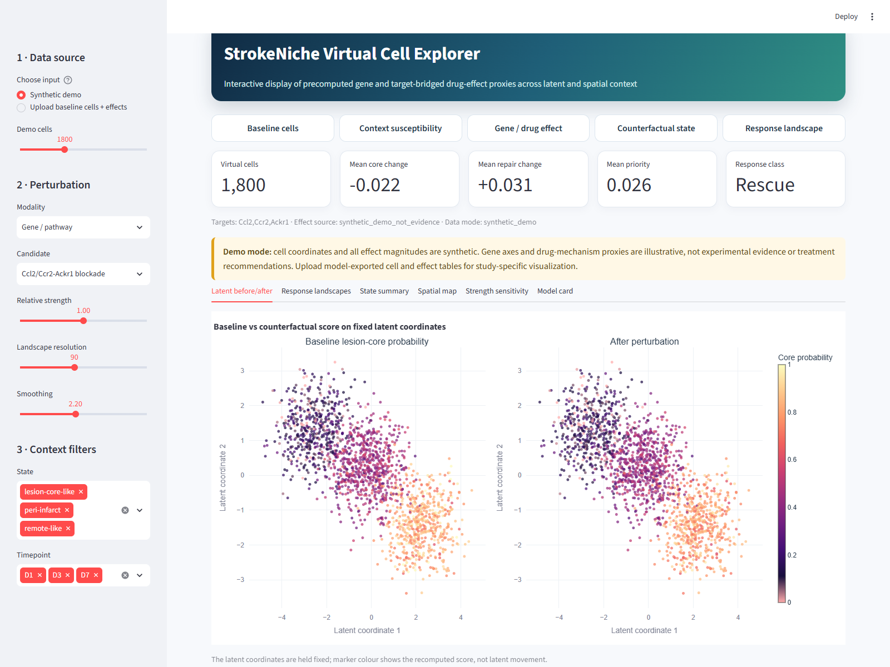
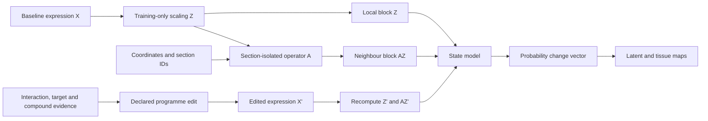

# StrokeNiche virtual-cell landscape

**Spatial counterfactual gene-programme sensitivity in ischaemic stroke**

Reusable code, research-script provenance, and a white-background interactive
explorer for visualizing precomputed gene/pathway and drug-mechanism perturbation proxies in
the StrokeNiche virtual-cell landscape.

> **Scope.** Outputs are computational counterfactuals and evidence summaries.
> They are not wet-lab knockout results, causal treatment effects, observed
> cell-state transitions, or clinical treatment recommendations.

## Manuscript v9 update

Version 0.3.0 adds the transparent StrokeNiche spatial-context extension and the
final numerical editing operators without removing the original explorer,
research-script provenance or white-background figure workflow. The public API
now includes:

- a section-isolated 12-neighbour operator and
  \(2^{-1/2}[Z,AZ]\) context feature map;
- an exactly matched self-edge control \(2^{-1/2}[Z,Z]\);
- explicit scaling of log-normalised programme features;
- a training-derived monotone up-modulation operator with an exact no-edit
  identity; and
- tests for graph isolation, L2-equivalence, monotonicity and one-hop design.

See [the v9 methods and validation map](docs/V9_METHODS_AND_VALIDATION.md),
[the path-free example configuration](configs/v9_analysis.example.json), and
[the release manifest](docs/V9_RELEASE_MANIFEST.md).

## Interactive perturbation explorer

The Streamlit app supports a safe synthetic demo and user-supplied model exports.
It provides latent before/after views, density-aware response landscapes,
state-stratified summaries, spatial projections, and relative-strength sensitivity.
It is a candidate-effect explorer, not a live graph-adapter or arbitrary-gene
inference service.



The same interface can switch to explicitly labelled drug-to-target proxies;
see the [drug-proxy example](docs/assets/drug_proxy_explorer.png).

```powershell
python -m venv .venv
.\.venv\Scripts\python -m pip install -e ".[visualizer]"
.\.venv\Scripts\python -m streamlit run app\perturbation_explorer.py
```

On macOS/Linux, use `workflow/run_visualizer.sh` after installing the package.
The demo contains no patient or study records. To visualize a real Step78D
export, first create the two compact CSV inputs:

```powershell
python scripts\export_visualizer_inputs.py `
  --response-table path\to\step78d_per_cell_response_proxy.csv `
  --context-table path\to\audited_step64_context.csv `
  --cells-out local_bundle\baseline_cells.csv `
  --effects-out local_bundle\perturbation_effects.csv
```

The audited context input is required by default so the exporter uses
`prob_lesion_core` rather than a potentially degenerate legacy probability field.

To add reviewed drug-to-target overlays, use
`scripts/build_drug_target_proxy_effects.py` with
`configs/drug_target_mapping.example.csv`. Drug rows inherit the mapped gene
effect and remain explicitly labelled `target-bridged proxy`.

## What is reusable

- `src/strokeniche_vc/classifier.py`: balanced expression-state classifier and
  explicit gene-expression counterfactuals.
- `src/strokeniche_vc/context.py`: section-isolated kNN context operator and
  expression/self-edge/spatial feature maps.
- `src/strokeniche_vc/operators.py`: precisely specified down- and
  up-modulation operators for log-normalised model inputs.
- `src/strokeniche_vc/response.py`: transparent context-susceptibility and signed
  candidate-effect calculations.
- `src/strokeniche_vc/landscape.py`: density-aware Gaussian landscape grids.
- `src/strokeniche_vc/splitting.py`: sample/section-grouped splits and removal of
  graph edges crossing train/validation/test partitions.
- `scripts/make_inductive_split.py`: command-line conversion of legacy spot-random
  masks to group-isolated masks, train-only coordinate scaling, and a within-group
  rebuilt kNN graph.

## Model and evidence layers



The layers must remain distinguishable:

1. **Observed baseline:** measured expression, coordinates, and annotations.
2. **Step72C classifier counterfactual:** selected expression features are scaled,
   then state probabilities are recomputed.
3. **Step78D visualization proxy:** candidate mean effects are modulated by a
   heuristic susceptibility score and Gaussian-smoothed in a 2-D latent map.
4. **Drug-target bridge:** a drug may inherit a target perturbation only as a
   target-level proxy.
5. **LINCS evidence:** signature reversal is transcriptional similarity evidence,
   not efficacy.

## Research-script provenance

Selected numbered research scripts from the working project are curated under
`scripts/core_pipeline/`, `scripts/experiments/`, and
`scripts/final_visualization/`. They document the analysis lineage but still
contain study-specific paths and are not the public API. All selected copies except
Step13B are unchanged; Step13B's explicit safety changes, source hash, and released
hash are recorded in [`docs/curated_code_manifest.tsv`](docs/curated_code_manifest.tsv). See
[`docs/CORE_INNOVATION.md`](docs/CORE_INNOVATION.md) for the map from concepts to
scripts and [`docs/SCIENTIFIC_LIMITATIONS.md`](docs/SCIENTIFIC_LIMITATIONS.md)
before interpreting outputs.

## Data

No patient-level, study-level, model-checkpoint, or large result data are included.
The inherited bulk code/figure/table manifests and `release_summary.json` are
historical inventories, not current reconstruction guarantees; see
[`docs/HISTORICAL_MANIFEST_NOTICE.md`](docs/HISTORICAL_MANIFEST_NOTICE.md). Use the
curated code manifest and a freshly generated data SHA-256 manifest. Do not commit
uploaded visualizer inputs.

## Reproducible checks

```bash
python -m pip install -e ".[test]"
python -m pytest -q
python -m compileall -q src app scripts
```

These checks validate the lightweight package, CLI safeguards, app smoke paths,
and Python syntax. They do not run legacy adapter training or reproduce scientific
results; no validated end-to-end legacy training environment is supplied.
`environment-core.yml` is the tested lightweight environment; `environment.yml`
is retained only as a historical snapshot and does not include all model-training
dependencies such as PyTorch.

## Citation and release status

Citation metadata are in `CITATION.cff`. The repository license file retains an
institutional-approval placeholder from the original repository; confirm the final
license and article/Zenodo identifiers before tagging a public release.
